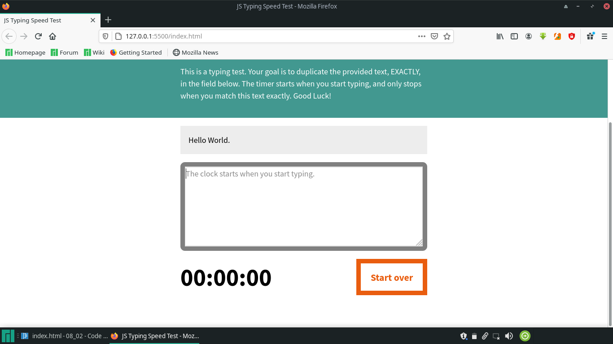
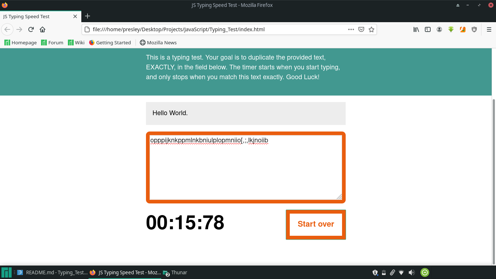

### **TYPING SPEED TEST**

This is one of my small practice mini projects with javascript were i time a person's typing speed. 

I has color change effects on the border to grey dormant, blue things are great, orange well you aren't doing fine.

### **Code Preview**
```
const testWrapper = document.querySelector(".test-wrapper");
const testArea = document.querySelector("#test-area");
const originText = document.querySelector("#origin-text p").innerHTML;
const resetButton = document.querySelector("#reset");
const theTimer = document.querySelector(".timer");

var timer = [0,0,0,0];
var interval;
var timerRunning = false;

// Add leading zero to numbers 9 or below (purely for aesthetics):
function leadingZero(time){
    if(time <= 9){
        time = "0" + time;
    }  
    return time
}

// Run a standard minute/second/hundredths timer:
function runTimer(){
    let currentTime = leadingZero(timer[0]) + ":" + leadingZero(timer[1]) + ":" + leadingZero(timer[2]);
    theTimer.innerHTML = currentTime;
    timer[3]++;
```


## **Screenshots**

1. 

2. 
